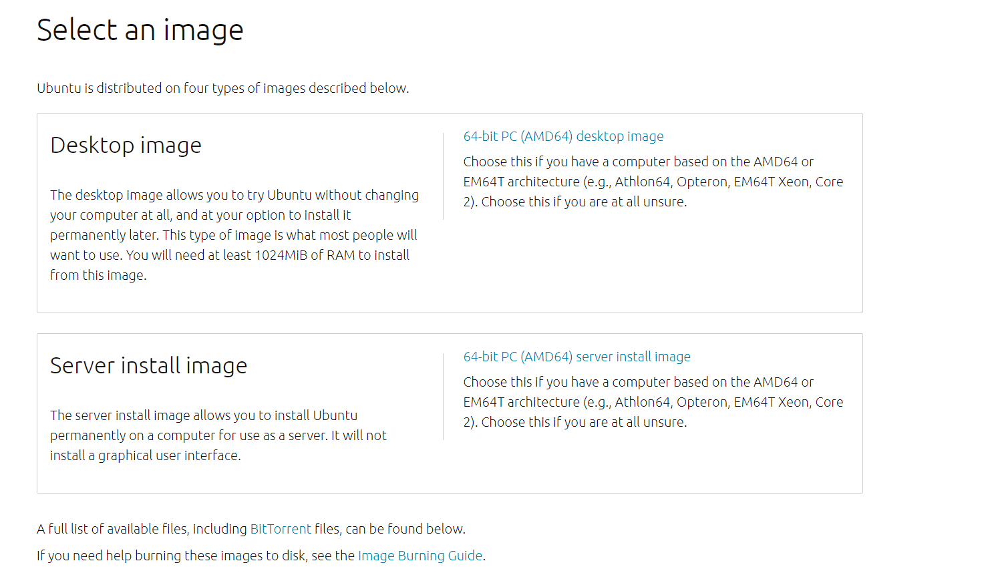

#### 实验1 ubuntu20.04无人值守安装

##### 1. 手动安装ubuntu20.04

* 下载纯净版 Ubuntu 安装镜像 iso 文件（ubuntu-20.04.2-live-server-amd64.iso) 

   

* 配置双网卡
  
  

* 安装完成
  
  

##### 2. 制作包含 user-data 和 meta-data 的 ISO 镜像文件

* 下载老师提供的可用配置文件user-data

* 创建空文件meta.data

* 上传文件到安装好的ubuntu20.04虚拟机
  
 

* 安装cloud-image-utils

  

* 制作镜像

  

* 将镜像传到本地

  

##### 3. 无人值守安装 

* 新建虚拟机focal-init

 

* 移除上述虚拟机「设置」-「存储」-「控制器：IDE」并按顺序先挂载「纯净版 Ubuntu 安装镜像文件」后挂载 focal-init.iso 

  

* 启动虚拟机，命令行中出现以下提示信息时，输入 yes 并按下回车键。 

  

* 无人值守安装完成

  

##### 参考资料

* https://c4pr1c3.github.io/LinuxSysAdmin/chap0x01.exp.md.html
  
* https://www.bilibili.com/video/BV1Hb4y1R7FE