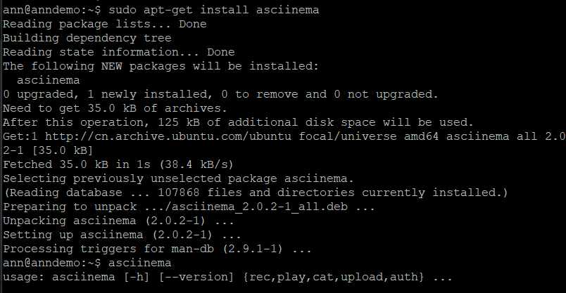

### 实验二 

#### 实验环境

* linux20.04
* asciinema

#### 实验要求

* [ √ ] 确保本地完成asciinema auth，并关联本地账号和在线账号
* [ √ ] 上传vimtutor操作全程录像
* [ √ ] 完成自查清单

#### 实验过程

1. 安装asciinema

   

2. 确保本地已经完成asciinema auth，并在asciinema成功关联了本地账号和在线账号（忘记截图了）

3.  vimtutor操作录像

* lesson 1.1-1.6
  

* lesson 2.1-2.7
  

* lesson 3.1-3.4

* lesson 4.1-4.4

* lesson 5.1-5.4

* lesson 6.1-6.5

* lesson 7.1-7.3

#### vimtutor完成后的自查清单

1. 你了解vim有哪几种工作模式？ 
   
   * 命令模式、输入模式、编辑模式

2. Normal模式下，从当前行开始，一次向下移动光标10行的操作方法？如何快速移动到文件开始行和结束行？如何快速跳转到文件中的第N行？ 
   * 向下移动10行：`10j`
   * 使当前光标直接跳转到文件最后一行:`G`
   * 使当前光标跳转到第一行：`gg`
   * 跳转到文件第N行：`N（数字）+G`

3. Normal模式下，如何删除单个字符、单个单词、从当前光标位置一直删除到行尾、单行、当前行开始向下数N行？ 
   * `x`：删除单个字符 
   * `de`：删除单个单词 
   * `d$`：从当前光标删除至当前行末尾 
   * `dd`:删除当前一整行 
   * `Ndd`:删除N行

4. 如何在vim中快速插入N个空行？如何在vim中快速输入80个-？ 
   * 插入N个空行： `N+o` 
   * 插入80个- ： `80i-`

5. 如何撤销最近一次编辑操作？如何重做最近一次被撤销的操作？ 
   * 输入`u`来撤销最后执行的命令 
   * 输入`U`来撤销对整行的修改
   * `CTRL+R`重做最近一次被撤销的操作

6. vim中如何实现剪切粘贴单个字符？单个单词？单行？如何实现相似的复制粘贴操作呢？ 
   * 剪切单个字符：`x`
   * 剪切单个单词:`dw` 
   * 剪切单行：`dd`
   * 粘贴:`p`

7. 为了编辑一段文本你能想到哪几种操作方式（按键序列）？ 
   * 从当前字符之前开始编辑：`i`
   * 从当前字符之后开始编辑：`a`
   * 在光标所在行的行末之后插入文本：`A`
   * 删除字符：`x`
   * 删除：`d motion`（w删到单词起始 e删到当前单词末 $删到行末）
   * 替换字符：`r+要替换字符`
   * 更改：`c motion`（同上）
   * 字符串全文替换：`:%s/old/new/g`

8. 查看当前正在编辑的文件名的方法？查看当前光标所在行的行号的方法？
   * `CTRL+G`：显示当前编辑的文件名和文件中光标的位置

9. 在文件中进行关键词搜索你会哪些方法？如何设置忽略大小写的情况下进行匹配搜索？如何将匹配的搜索结果进行高亮显示？如何对匹配到的关键词进行批量替换？
    * `/keyword` 或者 `?keyword`，重复查找可以按n或者N
    *  `:set ic` 忽略大小写
    *   `:set hls is` 进行高亮显示 
    *   `:%s/old/new/g` 批量替换

10. 文件中最近编辑过的位置来回快速跳转的方法？
    * `曾经停留的行号+G`
    * `Ctrl+i和Ctrl+o`

11. 如何把光标定位到各种括号的匹配项？
    * 使用%字符

12. 在不退出vim的情况下执行一个外部程序的方法？
    * `:!+外部命令`

13. 如何使用vim的内置帮助系统来查询一个内置默认快捷键的使用方法？如何在两个不同的分屏窗口中移动光标？
    * 查询内置默认快捷键：`help+快捷键`
    * `Ctrl+w+上下方向键`

