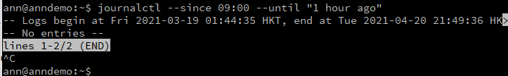

# 实验三 

## 实验环境

* linux20.04

* asciinema

## 实验要求

- [x] 按照阮一峰的「Systemd 入门教程：命令篇」与「Systemd 入门教程：实战篇」动手实操，完整实验操作过程通过asciinema进行录像并上传

- [x] 完成课后自查清单

## 实验过程

* Systemd 入门教程：命令篇

[](https://asciinema.org/a/AGVGoEWM2GZzW22MEGSDvZgPN)

* Systemd 入门教程：实战篇

[](https://asciinema.org/a/BSYWfBrvZvbiwpOC07FX7Ha1I)

## 自查清单
1. 如何添加一个用户并使其具备sudo执行程序的权限？

```usermod -a -G sudo username```

2. 如何将一个用户添加到一个用户组？

```usermod -a -G groupname username```

3. 如何查看当前系统的分区表和文件系统详细信息？

```
#查看分区表
sudo fdisk -l 
#以更易读的方式显示目前磁盘空间和使用情况   
df -h
```

4. 如何实现开机自动挂载Virtualbox的共享目录分区？

```mount -t vboxsf sharing /mnt/share```

5. 基于LVM（逻辑分卷管理）的分区如何实现动态扩容和缩减容量？

```
# 扩容
lvextend -L size dir
# 缩减
lvreduce -L size dir
```

6. 如何通过systemd设置实现在网络连通时运行一个指定脚本，在网络断开时运行另一个脚本？
* 修改`systemd-networkd.service`配置文件

    ```
    [Service]
    ExecStart=<path_service1> start
    ExecStop=<path_service2> stop
    ```


7. 如何通过systemd设置实现一个脚本在任何情况下被杀死之后会立即重新启动？实现杀不死？
* 修改配置文件

    ```
    [Service]
    Restart=always
    ```

## 实验问题

* 修改时区时报错
  ```Failed to set time: Automatic time synchronization is enabled```

  解决办法：关闭时间时间同步
  ```timedatectl set-ntp no```

* `$ journalctl --since 09:00 --until "1 hour ago"`命令执行时报错：
  ```Failed to add match '09:00': Invalid argument ```

  啊这，换了个时间执行它自己好了。

  

## 参考资料

[Systemd 入门教程：命令篇](http://www.ruanyifeng.com/blog/2016/03/systemd-tutorial-commands.html)

[Systemd 入门教程：实战篇](http://www.ruanyifeng.com/blog/2016/03/systemd-tutorial-part-two.html)

[LyuLumos的ch0x03实验报告](https://github.com/CUCCS/2021-linux-public-Lychee00/blob/chap0x03/chap0x03/0x03exp.md)

[Zhang1933的ch0x03实验报告](https://github.com/CUCCS/2021-linux-public-Zhang1933/blob/ch0x03/ch0x03/%E7%AC%AC%E4%B8%89%E7%AB%A0-linux%E6%9C%8D%E5%8A%A1%E5%99%A8%E7%B3%BB%E7%BB%9F%E7%AE%A1%E7%90%86%E5%9F%BA%E7%A1%80.md)
