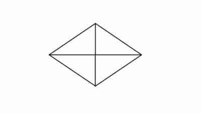
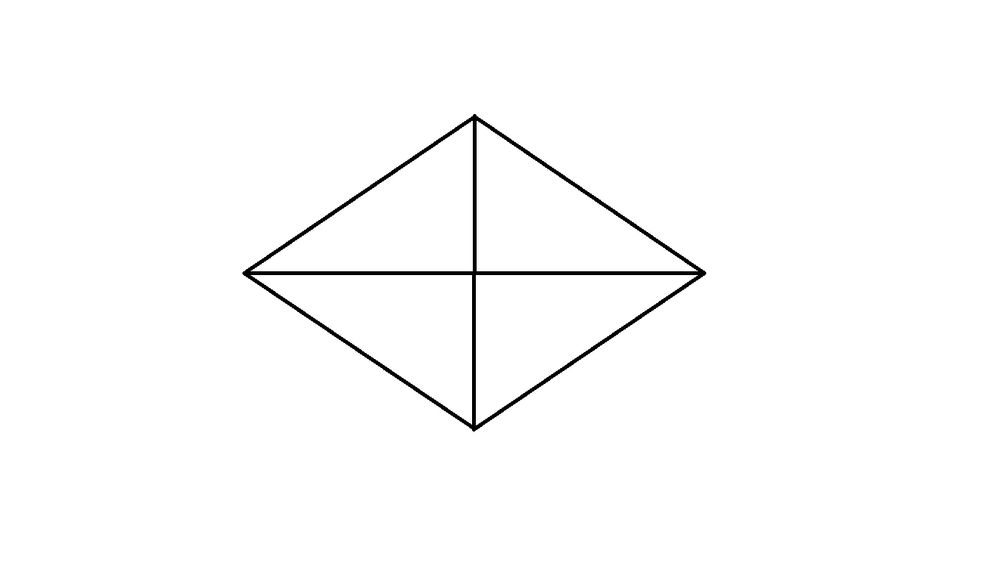
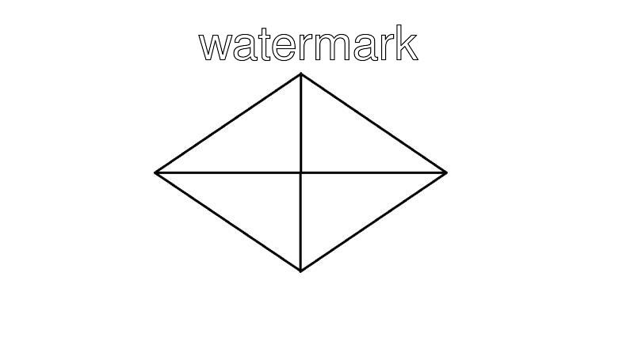
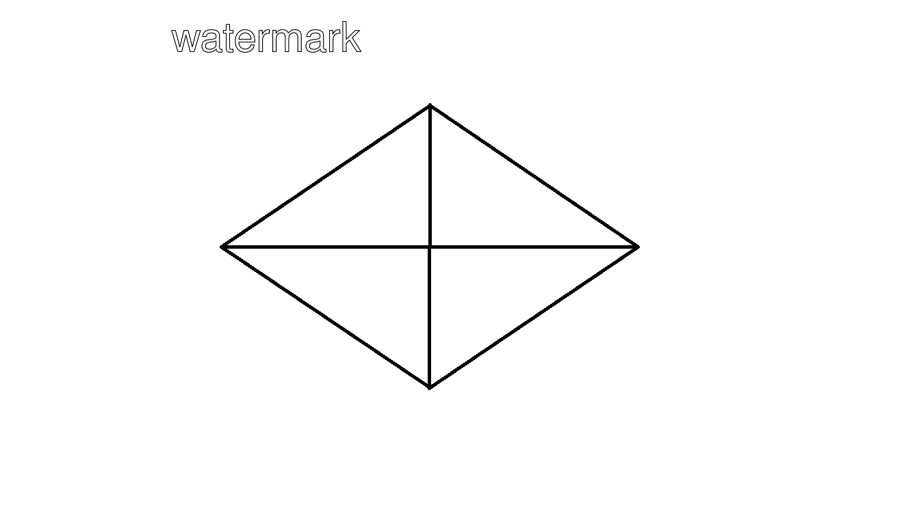
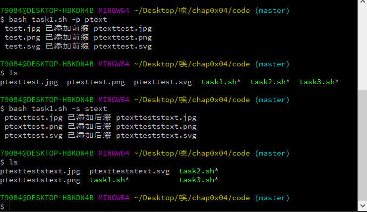
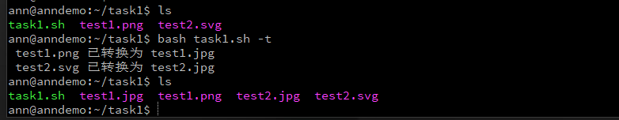

## task1实验结果

* bash task1.sh -q  20

  

* bash task1.sh -r 50%

  

  

  

* bash task1.sh -w 60 none watermark

  

  

* bash task1.sh -p ptext && bash task1.sh -s stext

  

* bash task1.sh -t

  